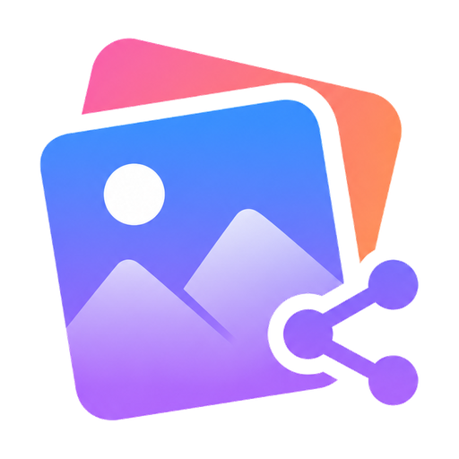

<p align="center">
  
</p>

# PhotoShare

**A self-hosted photo & video library for your home network — runs as a Docker container or a native Windows desktop app.**

PhotoShare turns a folder of photos and videos into a fast, private, Google
Photos-style gallery you can browse from any device on your LAN — no cloud, no
subscriptions, no third-party accounts. It's a single Go binary with an embedded
React web UI, packaged as a small Docker image (Linux) or an installer with a
tray icon and a native window (Windows).

**Current version: v2.12.1** · Linux / Docker · Windows

---

## Features

### Browse & view
- **Folder-based library** — keeps your existing folder structure; tight Google Photos-style grid with three density sizes.
- **Cinematic transitions** — opening a folder fades in with a quick staggered card zoom (respects `prefers-reduced-motion`).
- **Fast cached thumbnails** for photos, videos and HEIC, pre-generated in the background.
- **Full-screen viewer** — keyboard navigation, rotate, EXIF info, download, and an in-strip filmstrip.
- **HEIC support** — Apple HEIC photos are decoded on the server (via libheif) and shown as JPEG.
- **Video that plays anywhere** — HEVC/H.265 (iPhone `.MOV`/`.mp4`) is transcoded to H.264 on first play, cached, and served with correct MIME so it plays in **any** browser including Firefox. H.264 files stream directly.
- **Hover-scrub** video previews in the grid.

### Find
- **Search** by name with **type** (photo/video) and **date** filters.
- **Smart (AI) search** — find photos by what they show ("beach at sunset"), powered by local CLIP. Optional, fully private, off unless the ML sidecar is enabled.
- **Duplicate finder** — content-hash based.
- **Storage stats** — library size, counts, and real disk usage.
- **On This Day** memories — background date index surfaces past photos.
- **Map view** — plots photos by EXIF GPS on an OpenStreetMap.

### Manage (admin)
- Delete, move, copy, rename, rotate — single or batch.
- **Drag-and-drop** onto sidebar folders; **shift-click range** and **marquee** multi-select.
- **Recycle bin** — restore deleted items; auto-purges after 90 days.
- **Uploads** — public inbox + authenticated uploads, with optional **auto-sort into Year/Month** folders by capture date.

### Accounts & security
- **Full login gate** — nobody sees anything until signed in.
- **Multiple users** with **admin / viewer** roles, managed in-app.
- **Optional guest access** toggle.
- **Persistent sessions** — HttpOnly cookies, ~30-day sliding expiry ("stay logged in").
- **bcrypt**-hashed passwords and **login rate-limiting**.

### Sharing & UX
- **QR connect** — scan to open the gallery on a phone (uses the real published address).
- **PWA install** on phones.
- **Optional SMB** network path display per folder.
- **Upload notifications** — POST to an **ntfy** or **Discord** webhook when photos are uploaded (Settings → System). Optional, off by default.
- **Dark / light / auto** themes (Material, near-black dark).
- **Keyboard shortcuts** overlay (`?`).

---

## Tech stack

| Layer      | Tech                                                      |
|------------|----------------------------------------------------------|
| Backend    | Go (`net/http`), assets embedded via `embed`             |
| Frontend   | React + Vite, `@tanstack/react-virtual`, Leaflet (map)   |
| Images     | `disintegration/imaging`, `golang.org/x/image`, `goexif` |
| Video/HEIC | FFmpeg / ffprobe + libheif (`heif-convert`)              |
| Auth       | `golang.org/x/crypto/bcrypt`, cookie sessions            |
| Extras     | `skip2/go-qrcode` (QR)                                    |

---

## Run with Docker

```bash
docker compose up -d --build
```

Edit `docker-compose.yml` first to point `/photos` at your library and set an
initial `ADMIN_PASSWORD`. Config persists in `./photoshare-config` (`/config`).

| Env var | Purpose | Default |
|---------|---------|---------|
| `PHOTO_DIR` | Library path inside the container | `/photos` |
| `DATA_DIR` | Where config/cert persist | `/config` |
| `PORT` | Listen port inside the container | `8080` |
| `HTTP_ONLY` | Plain HTTP (put a reverse proxy in front for TLS) | `true` |
| `ADMIN_USER` / `ADMIN_PASSWORD` | First-run admin account (ignored once accounts exist). If `ADMIN_PASSWORD` is unset, a random one is generated and printed once to the logs | `admin` / random |
| `SERVER_IP` | Host LAN IP for correct QR / network links | auto |
| `PUBLIC_PORT` | Published host port for QR / share links (if different from `PORT`) | = `PORT` |
| `PUBLIC_URL` | Full override for the advertised URL (wins over the above) | — |
| `AUTO_SORT` | Auto-file inbox uploads into Year/Month | `false` |

Saving Settings exits the process; with `restart: unless-stopped`, Docker brings
it back with the new config.

### Build / run without Docker

```bash
make build                                  # builds the React app + Go binary
./photoshare -dir /photos -http-only -port 8080
```

### Notes
- The **photo directory must exist** — the app won't auto-create it (so a typo can't spawn an empty library), but it auto-creates `_Trash` and `_Uploads` inside it.
- Logs go to stdout (`docker logs photoshare`).
- Transcoded video and thumbnails are cached in the container's temp dir, **not** in your photo library.

---

## Run on Windows

PhotoShare also ships as a native Windows desktop app: a system tray icon,
its own window (no browser tab), and an installer like any other Windows
program — no Docker required.

1. Download and run **PhotoShareSetup.exe** (Intel/AMD x64). On a Windows 11
   ARM device (Snapdragon etc.) grab **PhotoShareSetup-arm64.exe** for a
   native build — the x64 one also runs there via emulation if you prefer.
2. On first launch, pick your photo library folder and create the admin
   account right in the app — no config file editing needed.
3. PhotoShare lives in the system tray; closing the window just hides it.
   Right-click the tray icon for **Open**, **Open in browser**, **Copy URL**,
   and **Quit**.
4. In Settings, optionally enable **"Start PhotoShare when Windows starts"**
   and check for updates.

Config and the library path live in `%APPDATA%\PhotoShare`; the installer
never touches your photos.

### Building the Windows installer yourself

```bash
make build-windows                 # x64: builds the React app + photoshare.exe
iscc windows\installer.iss         # requires Inno Setup (https://jrsoftware.org/isinfo.php)

make build-windows-arm64           # ARM64 build instead
iscc /DAppArch=arm64 /DSetupName=PhotoShareSetup-arm64 windows\installer.iss
```

The compiled installer lands in `windows/Output/PhotoShareSetup.exe` (or
`PhotoShareSetup-arm64.exe`).
Re-running it for a later version updates the binary in place and keeps your
existing library path and accounts.

---

## Releasing a new version

One repo, one codebase — Go build tags (`*_windows.go` vs `*_stub.go`) keep
the Windows-only code out of the Linux/Docker build and vice versa. Pushing
code alone doesn't update anyone; each platform's artifact is built and
published separately, automatically, by [`.github/workflows/release.yml`](.github/workflows/release.yml)
whenever a version tag is pushed:

```bash
git tag v2.3
git push origin v2.3
```

That single push triggers two parallel jobs:
- **Windows**: builds `photoshare.exe`, compiles the Inno Setup installer,
  and attaches `PhotoShareSetup.exe` to the GitHub Release for that tag
  (creating the release if it doesn't exist yet) — this is what the app's
  in-app "Check for updates" button looks for.
- **Docker**: builds the image and pushes it to
  `ghcr.io/jpinela24/photoshare:v2.3` and `:latest`.

No secrets to configure — both jobs use the automatic `GITHUB_TOKEN`.

---

## Changelog

| Ver | Highlights |
|-----|-----------|
| **1.0** | Core photo server: browse, full-screen viewer, search, duplicate finder, storage stats, recycle bin, uploads, admin (delete/move/copy/rename/rotate + batch), HTTPS, PWA |
| **1.5** | Apple "liquid glass" redesign; collapsible push-sidebar |
| **1.6** | Full SVG icon set; dark / light theme toggle |
| **1.7** | QR connect, auto theme, 90-day trash auto-purge, hover-scrub video, HTTP-only option, bcrypt passwords + login rate-limit, panic recovery |
| **1.8** | Auto-sort uploads into Year/Month folders; "On This Day" memories |
| **1.9** | Map view (EXIF GPS), shift-click range + marquee select, `?` shortcuts overlay |
| **2.0** | Login gate with multiple accounts (admin/viewer) + guest access, cookie sessions; Docker/Linux deployment with env-var config |
| **2.1** | Google Photos / Material restyle — tight grid, image-only photo tiles, blue accent, dark + light |
| **2.2** | HEIC via libheif; on-the-fly HEVC→H.264 transcode with explicit MIME (plays everywhere); cinematic folder transitions; `PUBLIC_PORT`/`PUBLIC_URL` for correct QR; real disk-space stats; hidden housekeeping folders; **Docker/Linux only** |
| **2.3** | Windows support is back, done properly this time: native installer, system tray, WebView2 window, in-app first-run setup (pick your library folder + create the admin account with no config editing), opt-in login autostart, in-app update check |
| **2.4** | Tray icon no longer lingers as a "ghost" after quitting or uninstalling — the tray watches the app's process and disposes itself the moment it's gone (quit, crash, Task Manager, or uninstall); `loadConfig` no longer resurrects default values into an existing config; Settings warns when the admin account still uses a default password; Windows window loads loopback (no "Not Secure"), blocks browser zoom/reload, and remembers its size/position |
| **2.4.1** | Windows desktop app now always serves plain HTTP — fixes the `NET::ERR_CERT_AUTHORITY_INVALID` screen that appeared in the window when an older config had self-signed HTTPS enabled (the "Use HTTPS" toggle is hidden on Windows, since real TLS belongs in a reverse proxy, not the desktop build) |
| **2.4.2** | New brand logo throughout — browser tab favicon, PWA/home-screen icon, Windows tray + taskbar icon, and the login/onboarding screens all use the real PhotoShare mark |
| **2.4.3** | The logo is now embedded in the Windows `.exe` itself (multi-size icon + version metadata), so it shows in Explorer, Add/Remove Programs, and the app's file properties — not just at runtime |
| **2.4.4** | Start Menu and desktop shortcuts now carry the logo explicitly (the installer ships `icon.ico` and points the shortcuts at it), fixing the generic shortcut icon |
| **2.5.0** | Native **Windows 11 ARM64** build — a separate `PhotoShareSetup-arm64.exe`, with the in-app updater auto-picking the installer matching your CPU (the x64 build still runs on ARM via emulation if you prefer) |
| **2.5.1** | The Windows window's native title bar is now dark to match the app, instead of the default light caption |
| **2.5.2** | Fixed the Windows app exiting (and not relaunching) after first-run setup or a settings save — the relaunched copy was tripping the single-instance lock the old process still held; the lock is now released before relaunch |
| **2.6.0** | Security hardening from an audit: `/api/quit` + `/api/show` are now local-only + POST (no remote shutdown); trash-restore and batch-rename can't write outside the library (path-traversal guards); first-run seeds a **random** admin password instead of a fixed default; updated `golang.org/x/crypto`/`x/image`; `govulncheck` in CI; reproducible `npm ci` builds; added path-boundary + authorization regression tests |
| **2.7.0** | Redesigned the Copy/Move folder picker into a single-pane navigator — breadcrumb, click a folder to step into it, live destination, and a **"New folder here"** button so you can create a destination on the spot |
| **2.7.1** | "Check for updates" now shows on every platform, not just Windows — on Docker/browser it reports whether a newer release exists and how to update (`git pull && docker compose up`), with a link to the release notes |
| **2.7.2** | Fixed the Duplicate Finder hanging on "Scanning library…" forever on large libraries — the scan now runs in the background with live progress (no long blocking request that drops behind a proxy/Tailscale), and only fully hashes files that share both a size and a 64 KiB fingerprint, so it no longer reads gigabytes of unrelated videos |
| **2.7.3** | Sharper Windows app/shortcut icon — the `.ico` is regenerated with high-quality downscaling + light sharpening at every size, fixing the low-res desktop/Start-Menu icon |
| **2.8.0** | Reorganized Settings into clean **tabs** (General · Sharing · Users · System) instead of one long form. New **"Enable Web UI on your network"** toggle (Windows) — when off, the server binds to loopback only so only this PC can use it while the app window keeps working; on by default |
| **2.8.1** | Windows-Explorer-style **Quick access** in the library Browse dialog — jump straight to Desktop, Downloads, Documents, Pictures, Videos, Music or Home (OneDrive-aware), with drives under "This PC". Also restyles the picker, which had lost its styling in 2.7.0 |
| **2.9.0** | **AI semantic search (Phase 1)** — find photos by what they show ("beach at sunset") instead of filenames, powered by local CLIP running in an optional `photoshare-ml` sidecar. Fully private (no cloud) and feature-flagged behind `ML_URL`, so it's off unless enabled. Adds a "Smart" search toggle in the sidebar with live indexing progress |
| **2.10.0** | **Face recognition — People view (Phase 2)** — detects faces on the same ML sidecar (small `buffalo_s` model), groups them into people you can name and browse, all local. Deliberately low-impact: **off by default** (`FACES=1` to enable), lazy-loaded, and the background detector yields to the semantic-search indexer so the two never compete for CPU |
| **2.10.1** | Face recognition is now a **Settings toggle** (System tab) instead of env-only — flip it on/off in the app when the AI sidecar is available; `FACES=1` still works as an override |
| **2.10.2** | **Removed face recognition / the People view** — the detector produced too many false positives to be useful. Semantic (Smart) search is unaffected; the ML sidecar is back to CLIP-only (no insightface), so it's smaller and builds cleanly |
| **2.11.0** | **Better path bar + keyboard/selection** — the address bar gets an **up-one-level** button, a home icon, and scrolls on long paths. Full grid keyboard nav: **↑/↓ jump a row**, Home/End, Enter to open, **Backspace** to go up, Esc to clear, with the focused item auto-scrolled into view. Multi-select now works without entering select mode first: **⌘/Ctrl-click** toggles items, **Shift-click** ranges, **Space** toggles the focused item, **⌘/Ctrl+A** selects all (also fixes a range-select anchor bug) |
| **2.12.0** | **Upload notifications (integration)** — set an **ntfy** or **Discord** webhook in Settings → System and get a message whenever photos are uploaded (public inbox or a folder). Auto-detects Discord (JSON) vs ntfy/generic (plain POST + Title header), with a **Send test** button. Fire-and-forget, off by default |
| **2.12.1** | **Tighter, less-cluttered grid** — tiles are smaller across all three densities, the grid now **defaults to Small**, and your density choice is **remembered** across reloads (it used to reset to Medium every time) |

---

## License

Personal / home project. Use at your own risk on a trusted local network.

## Author

Made by [jpinela24](https://github.com/jpinela24).

🤖 Built with [Claude Code](https://claude.com/claude-code)
